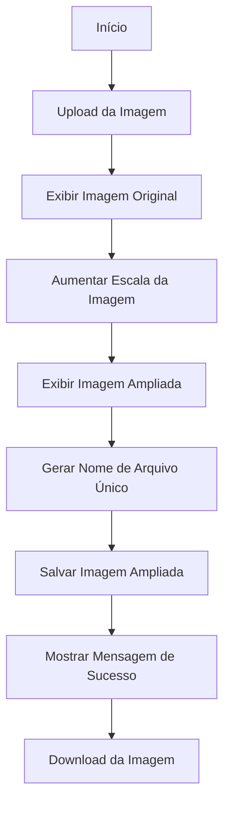

## 🌐 Web App - Streamlit Image Upscaler 

Confira a interface da aplicação **Streamlit Image Upscaler**:


Esta imagem mostra como a aplicação se apresenta, permitindo o upload e o aprimoramento de imagens com facilidade. Experimente você mesmo para ver o resultado ao aumentar a resolução das suas imagens! 📈🖼️


### 🛠️ Descrição do Projeto

O **Streamlit Image Upscaler** é uma aplicação web interativa desenvolvida com **Streamlit**, projetada para aumentar a escala e melhorar a resolução de imagens. Através deste aplicativo, os usuários podem fazer upload de imagens e obter uma versão ampliada e aprimorada com uma qualidade superior.

### 🔧 Lógica e Funcionalidade

1. **📈 Aumento de Escala e Melhoria da Imagem**
   - A função `upscale_image` utiliza o método de interpolação `INTER_CUBIC` da biblioteca **OpenCV** para aumentar a escala da imagem em 2x, garantindo a melhoria na qualidade da imagem.
   
2. **🖼️ Upload e Exibição da Imagem**
   - O usuário faz o upload de uma imagem através da interface do Streamlit, e a imagem original é exibida na página.

3. **⚙️ Processamento da Imagem**
   - A imagem é processada para ampliação usando a função `upscale_image`, e a imagem resultante é exibida ao lado da original.

4. **📂 Geração e Salvamento do Arquivo**
   - Um nome de arquivo único é gerado para evitar conflitos e a imagem ampliada é salva no diretório raiz com este nome exclusivo.

5. **⬇️ Download da Imagem**
   - A aplicação oferece um botão para download da imagem ampliada, permitindo que os usuários baixem o arquivo diretamente para seu dispositivo.

### 🛠️ Bibliotecas Utilizadas

- **Streamlit**: Para criar uma interface web interativa e simplificada.
- **OpenCV** (`cv2`): Para o processamento e melhoria das imagens.
- **NumPy** (`np`): Para manipulação e conversão de dados de imagem.
- **UUID**: Para gerar nomes de arquivos únicos e evitar sobreposições.

### 🧩 Diagrama de Lógica



## 🚀 Instruções de Instalação e Execução

### 📦 Instalar Dependências

Antes de executar o projeto, é necessário instalar as dependências. Utilize o seguinte comando para instalar todos os pacotes necessários listados no `requirements.txt`:

```bash
pip install -r requirements.txt
```
📥 Clonar o Repositório
Clone o repositório para seu ambiente local utilizando o comando abaixo:

```bash
git clone https://github.com/evolucaoit/Streamlit_image_upscaler.git
```
Navegue até o diretório do projeto clonado:

```bash
cd Streamlit_image_upscaler
```
🏃 Executar a Aplicação
Para iniciar a aplicação Streamlit, execute o seguinte comando:

```bash
python -m streamlit run streamlit-image-uspcaler.py
```
Substitua streamlit-image-uspcaler.py pelo nome do arquivo Python principal da sua aplicação. Por exemplo, se o arquivo principal for seuapp.py, o comando será:

```bash
python -m streamlit run seuapp.py
```

📋 Resumo
Instale as dependências com pip install -r requirements.txt.
Clone o repositório com git clone https://github.com/evolucaoit/Streamlit_image_upscaler.git.
Navegue até o diretório do projeto com cd Streamlit_image_upscaler.
Execute a aplicação com python -m streamlit run nome_do_arquivo.py.
Com esses passos, você poderá executar a aplicação e começar a usar o Streamlit Image Upscaler para ampliar e melhorar a qualidade das suas imagens! 🌟🖼️

💡 Pensamento por Trás da Implementação
🚀 Simplicidade e Eficácia: A aplicação é projetada para ser intuitiva, permitindo que usuários facilmente carreguem e ampliem imagens com um simples clique.
🔍 Qualidade da Imagem: A escolha do método INTER_CUBIC para interpolação visa oferecer a melhor qualidade possível na ampliação das imagens.
📂 Organização e Praticidade: O uso de um nome de arquivo único garante que os arquivos não sejam sobrescritos, e a funcionalidade de download melhora a praticidade da aplicação para os usuários.
Este projeto destaca minha capacidade de criar soluções práticas e visualmente atraentes com Streamlit e OpenCV, refletindo meu conhecimento avançado em desenvolvimento de aplicações web interativas e processamento de imagens. 🌟🖼️

